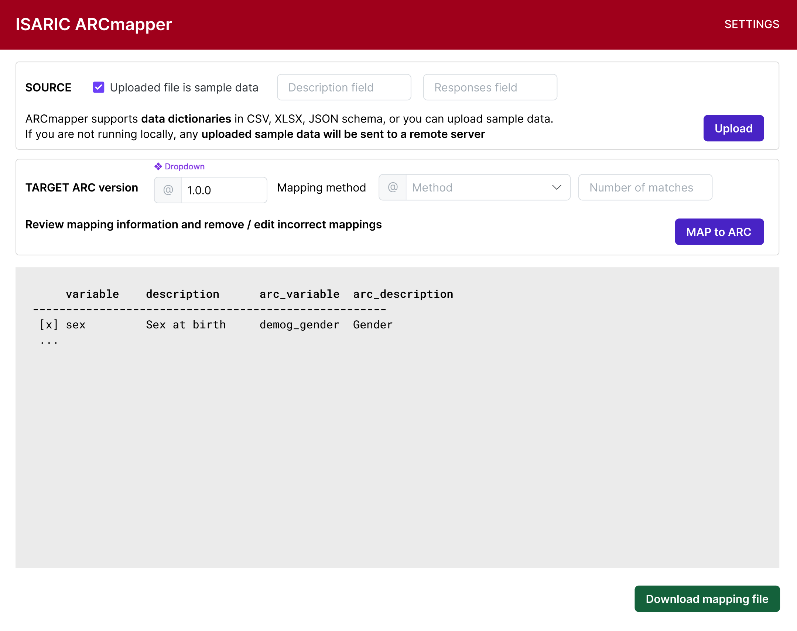

# PRD: arcmapper

Global.health Product Requirements Document for `arcmapper`, an utility designed
to facilitate automated mapping from data dictionaries to the [ISARIC ARC
schema].

Product Owner: [@abhidg](https://github.com/abhidg)

## Problem

Currently mapping from REDCap or bespoke schemas to the FHIRflat format is a
manual process. This takes up valuable curator time and reduces the speed to
analysis of clinical data collected in ISARIC.

## Proposed Solution

We aim to develop an `arcmapper` tool that will use natural language processing,
and possibly generative models to create a mapping from bespoke data
dictionaries and REDCap data schemas to the [ISARIC ARC schema]. ISARIC ARC is a
comprehensive data dictionary of standardised variables that define the range of
data ISARIC collects. ARC is linked to FHIRflat via a continuously updated
manual mapping and to standardised analysis pipelines in the
[PolyFLAME](https://polyflame.readthedocs.io) library.

The initial goal for a MVP is to have a mapping from REDCap schemas to tuples of
(ARC variable, choice) mappings. Users will be able to submit a data dictionary
in three formats: (i) by uploading a sample data file, (ii) uploading a JSON
schema, or (iii) uploading a data dictionary in CSV or XLSX format. In case of
the last option, the first column would be taken to be the variable name.

Once `arcmapper` has the data dictionary and a target ARC version, it will map
an entry in the source data dictionary like

| variable | choice |
|----------|--------|
| gender   | male   |
|          | female |

to the corresponding ARC variable

| raw_variable | raw_choice |
|--------------|------------|
| demog_sex    | 1, Male    |
|              | 2, Female  |

For non-categorical variables, only variable -> raw_variable mapping will be
performed. Users will be shown the proposed mapping and will be able to edit
mappings before downloading the mapping file.

## Users

Collaborators: ISARIC

The primary users of arcmapper are internal users (ISARIC) who will use it to
speed up ingestion of datasets into the ISARIC platform and ISARIC partners who
might use a self-hosted install of arcmapper and the ISARIC pipeline to perform
their own data analysis using standardised reproducible analytical pipelines
provided by the ISARIC data team.

## Technology

Initial MVP will be made using the [Dash](https://dash.plotly.com) locally
installable as well as deployable on a server such as repl.it.

*Advantages*: This will give users a easy to use interface for uploading data
dictionaries and getting a mapping file that can be submitted to
[FHIRflat](https://fhirflat.readthedocs.io) for data transformation from custom
formats to FHIR parquet files. Using a GUI will also increase the userbase who
can use it. Using Dash as compared to other UI frameworks such as Streamlit or
React has the advantage of aligning the technology stack with other ISARIC tools
such as
[BRIDGE](https://github.com/ISARICResearch/DataPlatform/tree/main/BRIDGE) (CRF
generation) and [VERTEX](https://github.com/ISARICResearch/VERTEX/)
(visualisation library).

*Disadvantages*: Using Dash will lose us some flexibility in terms of user
interface design, and any GUI is going to be less flexible than a Jupyter
notebook or Python interface.

## Non-goals

- Desktop app, this is not needed
- Mapping directly to FHIR, too complex. `arcmapper` should indicate if a
  variable in the source data dictionary cannot be mapped as it is not present
  in ARC.

[ISARIC ARC schema]: https://github.com/ISARICResearch/DataPlatform/tree/main/ARCH

## UX mockup

Figma: https://www.figma.com/design/bpaumciR1DPhGejjCXER86/ISARIC-ARCmapper

