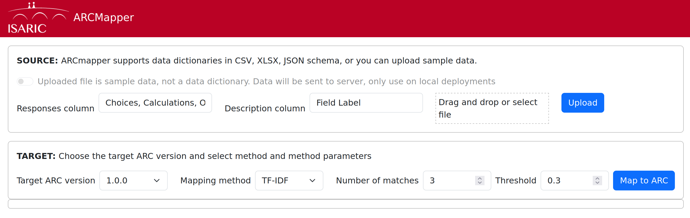

# ARCMapper

An utility to map data dictionaries (usually in REDCap format) to the [ARC
schema](https://github.com/ISARICResearch/DataPlatform).

## Installation

We use [`uv`](https://docs.astral.sh/uv/getting-started/installation/)
to setup and manage Python versions and dependencies. `uv` can be
installed using the following method:
```shell
curl -LsSf https://astral.sh/uv/install.sh | sh
```
If you do not have `curl` installed, then use `brew install curl` on
macOS or `sudo apt install curl` on Debian/Ubuntu or `sudo dnf install
curl` on Fedora/RHEL.

```shell
git clone https://github.com/globaldothealth/arcmapper
uv sync
uv run arcmapper
```

This will run arcmapper in production mode. During development it is helpful to
see debug information, to do so run arcmapper with the `-d` or `--debug` flag.

## Usage

The browser should open with the ARCMapper interface



There are two steps:

**Step 1**: Upload a data dictionary. This is usually in REDCap format; if
column names differ from REDCap standards, then make sure to fill in the
correct column names. Click *Upload*.

**Step 2**: Map to ARC. First, choose an ARC version and a mapping method.
There are two mapping methods supported currently (i) TF-IDF, which uses text
frequency for similarity matching, and (ii) sentence transformers, which uses
semantic word representation based on training large text corpuses and the
transformers architecture.

Note that using sentence transformers for the first time will incur a delay
as models are downloaded from HuggingFace.

Additionally, you can also select the maximum number of matches to return and a
similarity threshold. The higher the similarity threshold, the more closer a
match needs to be for ARCmapper to display in the matches table.

Once you have pruned or altered the mapping table, click on **Download mapping
file** to download a mapping file that can be used by
[FHIRflat](https://fhirflat.readthedocs.io) for data transformations.
