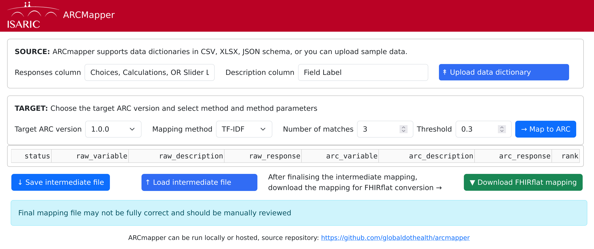
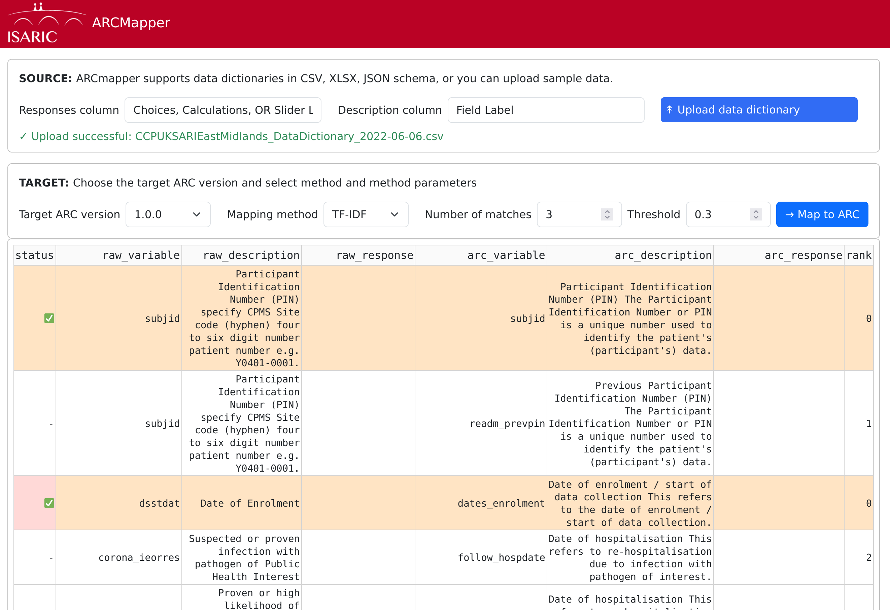

# ARCMapper

An utility to map data dictionaries (usually in REDCap format) to the [ARC
schema](https://github.com/ISARICResearch/DataPlatform).

> [!IMPORTANT]
> Mapping files are generated using AI and may contain errors. Always
> review them before using in production applications!

## Installation

We use [`uv`](https://docs.astral.sh/uv/getting-started/installation/)
to setup and manage Python versions and dependencies. `uv` can be
installed using the following method:
```shell
curl -LsSf https://astral.sh/uv/install.sh | sh
```
If you do not have `curl` installed, then use `brew install curl` on
macOS or `sudo apt install curl` on Debian/Ubuntu or `sudo dnf install
curl` on Fedora/RHEL.

```shell
git clone https://github.com/globaldothealth/arcmapper
uv sync
uv run arcmapper
```

This will run arcmapper in production mode. During development it is helpful to
see debug information, to do so run arcmapper with the `-d` or `--debug` flag.

## Usage

The browser should open with the ARCMapper interface



There are three steps:

**Step 1**. *Upload a data dictionary*. This is usually in REDCap format; if
column names differ from REDCap standards, then make sure to fill in the correct
column names *before* uploading.

**Step 2**: *Map to ARC*. First, choose an ARC version and a mapping method.
There are two mapping methods supported currently (i) TF-IDF, which uses text
frequency for similarity matching, and (ii) sentence transformers, which uses
semantic word representation based on training large text corpuses and the
transformers architecture. This will create an intermediate mapping which will
give you a few options (upto *Number of matches*) for each mapping from the
uploaded data dictionary to ARC. Choose the correct mappings by clicking on the
first cell in the row which will display a green check mark indicator ✅. These
mappings will be used in Step 3.

In addition to the maximum number of matches, there is a similarity *threshold*
setting; the higher the similarity threshold, the more closer a match needs to
be for ARCmapper to display in the matches table.



At this point you can also save and load this intermediate mapping file, if you
want to continue work later. If you are loading an intermediate mapping file,
skip **Step 1**.

> [!NOTE]
> Using sentence transformers for the first time will incur a delay
> as models are downloaded from HuggingFace.

**Step 3**: *Generate final mapping*. Once you are happy with the final mapping,
you can merge with the [ARC to FHIRflat
mapping](arc-fhir/ARC_pre_1.0.0_preset_dengue.xlsx) to create the mapping file
suitable for being processed by [FHIRflat](https://fhirflat.readthedocs.io).
This can be done by clicking the *Download FHIRflat mapping* button which will
produce an Excel file, with a sheet for each FHIR resource.


